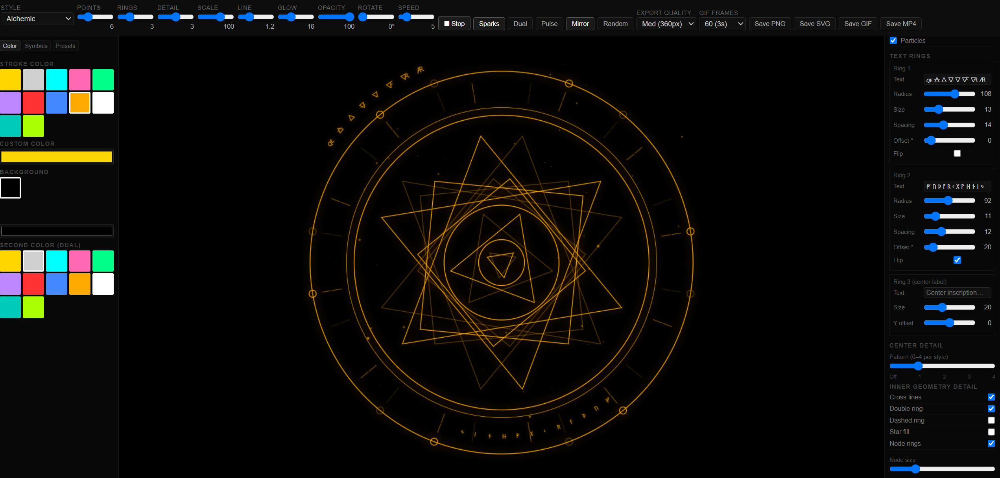

# 🔮 Magic Circle Generator

An interactive, browser-based magic circle designer. No installation, no dependencies, no internet required — open the file and start drawing.

**[▶ Try it live](https://zoutbot-cpu.github.io/Magic-Circles/)**

---



---

## Features

### 17 Geometry Styles
| Style | Description |
|---|---|
| Star polygon | Classic n-pointed star with nested rings |
| Orbital | Concentric orbital rings with satellite nodes |
| Alchemic | Triangle, hexagram and square overlays |
| Pentagram | Five-pointed star with nested pentagrams |
| Mandala | Spoke-divided radial mandala |
| Celtic knot | Interlocking curved arc weave |
| Sigil | Angular web connecting n vertices |
| Rose window | Overlapping petal circles, cathedral style |
| Enochian | Four-tablet ceremonial grid |
| Sacred geometry | Flower of Life — hexagonal circle packing |
| Compass rose | Navigation wheel with cardinal arrowheads |
| Labyrinth | Alternating circles and rounded squares |
| Zodiac wheel | 12-house astrological segment wheel |
| Fractal rings | Recursive satellite circle expansion |
| Gothic arch | Pointed arches and trefoil tracery |
| Norse web | Vegvisir-style 8-stave rune compass |
| Chaos star | 8-arrow chaos star with inner web |

### Controls
- **Points / symmetry** — 3 to 16 vertices
- **Rings** — 1 to 8 concentric layers
- **Detail** — 1 to 5 geometry density levels
- **Scale, Line width, Glow, Opacity** — fine-tune the look
- **Rotate** — manual rotation offset
- **Animation speed** — controls live spin and export speed

### Color & Theming
- 12 stroke colour palettes (gold, silver, cyan, rose, emerald, purple, crimson, azure, amber, white, teal, lime)
- Custom colour picker for stroke and background
- 7 dark background presets
- Second colour for dual-layer mode

### Symbol System
Built entirely from Unicode — no fonts or internet needed:
- 🜀 Alchemical symbols (64 glyphs, Unicode U+1F700 block)
- ☉ Astrological glyphs (planets + zodiac)
- ᚠ Elder Futhark runes (24 characters)
- Α Greek alphabet
- Geometric shapes, occult symbols, Latin, Arabic
- Click to select, drag radius and size sliders to position

### Text Rings
- 3 independent configurable text rings
- Per-ring: text content, radius, font size, letter spacing, angular offset, flip direction
- Rings counter-rotate during animation
- Center inscription with Y-offset control

### Layers (toggle individually)
Outer rings · Inner rings · Geometry · Nodes · Spokes · Tick marks · Center core · Symbols · Text rings · Particles

### Inner Geometry Detail
- Cross lines, double ring, dashed ring, node rings toggles
- Node size, tick multiplier, spoke skip sliders
- **Center detail patterns** — 5 patterns per style (0–4), each progressively more complex

### Modes
- **Dual layer** — ghost second circle offset by half a step
- **Mirror** — reflected half at 35% opacity
- **Pulse** — breathing scale oscillation
- **Particles / Sparks** — glowing embers drift from the circle edge

### Presets
7 built-in named presets · Save and name your own · Delete saved presets

### Export
| Format | Details |
|---|---|
| PNG | Current frame at selected quality (240 / 360 / 480 / 720 px) |
| SVG | PNG embedded in SVG wrapper, opens in Inkscape / Illustrator |
| GIF | Looping animation, 20fps, 30–120 frames, quality-selectable |
| MP4 / WebM | Looping video at 30fps, 4–6 Mbps, WhatsApp-compatible |

Export quality and frame count are controlled by the two dropdowns in the toolbar.

---

## How to Use

1. **Open `index.html`** in Chrome, Brave, Edge, or Firefox
2. Pick a **style** from the dropdown
3. Adjust **Points**, **Rings**, and **Detail** to taste
4. Choose a **colour** from the left panel swatches or the custom picker
5. Enable **Runes / Symbols** from the Symbols tab
6. Type text into the **Text ring** fields in the right panel
7. Hit **Play** to animate, then export with **Save GIF** or **Save MP4**

> **Tip:** The **Random** button generates a surprise combination of style, symmetry, colour and rotation — great for inspiration.

---

## Export Tips

- **WhatsApp**: use **Save MP4** — WhatsApp converts GIFs to video anyway, so MP4 sends and plays better
- **High quality PNG**: set Export quality to **Ultra (720px)** before clicking Save PNG
- **Long GIF**: set GIF frames to **120** for a 6-second loop
- **Browser viewer**: drag any exported GIF into Chrome/Edge to play it — Windows Photos only shows the first frame

---

## Running Locally

No setup required:

```bash
# Option 1: just double-click index.html

# Option 2: serve with Python if you want a local URL
python -m http.server 8080
# then open http://localhost:8080
```

---

## Deploying to GitHub Pages

1. Fork or upload this repo to your GitHub account
2. Rename the HTML file to `index.html` if it isn't already
3. Go to **Settings → Pages**
4. Source: **Deploy from a branch** → `main` → `/ (root)`
5. Your live URL will appear within ~60 seconds:
   `https://yourusername.github.io/magic-circle-generator/`

---

## Technical Notes

- **Pure vanilla HTML/CSS/JS** — zero frameworks, zero dependencies
- **Self-contained** — the GIF encoder (LZW + NeuQuant palette quantiser) is written inline; no CDN calls
- **Works offline** — after first page load, no network needed for anything
- **file:// compatible** — opens directly from disk without a web server
- Canvas size auto-fits to your browser window
- GIF palette is sampled from 4 frames spread across the loop for accurate colour reproduction

---

## License

MIT — free to use, modify, and share.
